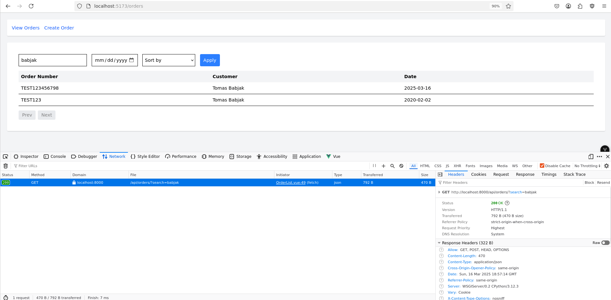

# Transport Management System

The goal of this assignment is to assess your ability to work with a full-stack application using Vue.js with TypeScript on the frontend and Django on the backend. You will be required to create a simple logistics Order Management system that consists of an Order model and a Waypoint model, where multiple waypoints can be attached to a single order

- **Frontend**: Minimalistic UI built with Vue.js, Tailwind CSS
- **Backend**: Built using Django with Django REST Framework (DRF)

## Table of Contents

- [Installation](#installation)
- [Frontend](#frontend-development)
- [Backend](#backend-development)
- [User Manual](#user-manual)
- [Deployment](#deployment)

## Installation

### Frontend (Vue.js)

1. Navigate to the frontend directory:

    ```bash
    cd app
    ```

2. Install the required dependencies:

    ```bash
    npm install
    ```

---

### Backend (Django with Django REST Framework)

1. Navigate to the backend directory:

    ```bash
    cd api
    ```

2. Set up a Python virtual environment and activate it:

    ```bash
    python3 -m venv venv
    source venv/bin/activate 
    ```

3. Install the required Python dependencies:

    ```bash
    pip install
    ```

4. Set up the database:

    ```bash
    python manage.py migrate
    ```

---

## Frontend Development

1. **Start the Vite Development Server**:

    ```bash
    npm run dev
    ```

   This will start the frontend app at `http://localhost:5173`.

2. **API URL Configuration**: 
   By default, the API URL is set to `http://localhost:8000` for local development. To switch development and production environments use `.env` file.

---

## Backend Development

1. **Start the Django Development Server**:

    ```bash
    python manage.py runserver
    ```

   This will start the backend API at `http://localhost:8000`.

2. **API Endpoints**:

   - **GET /api/orders/**: List all transport orders with pagination, filtering, and sorting.
   - **POST /api/orders/**: Create a new transport order.

---

## User manual

User is able to select from 2 main options - to **View Orders** or **Create  Order** rom top menu. 

### Create Order

* User is able to write **Order number** and **Customer name** into input boxes, select **Date** from date input and the add and remove **Waypoints**.
* To add new Waypoint user should use **Add Waypoint** button, when new card is shown where he can write **Location** - address of waypoint (for simplicity just one field right now) and select **Waypoint Type** from select box and 2 options - **Pickup** or **Delivery**. Also user can remove it with simple button below.


Afeter click on Create Order button, Vue app sends request to backend API that creates Order with given parameters


### View Order

User is able to see all created Orers in simple table with fields Order Number, Customer and Date. Also, user is able to **filter** these orders by Search filter where he is searching by Order Number and Customer name in **fulltext search**. To **filter by date**, user is able to use calendar input and to **sort**, user has 4 options to sort by Customer Name and Date ascending or descending. 


* All available orders



* Vies orders with fulltext search


* View orders with date filter


* View orders sort by latest Date

## Deployment

//TODO